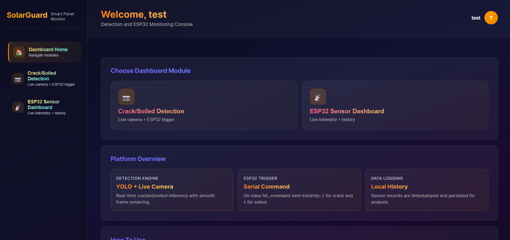
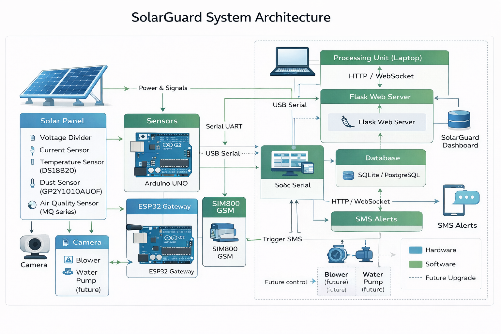

# SolarGuard – Smart Solar Panel Maintenance System



SolarGuard is an automated, low‑cost solution for continuous monitoring and maintenance of solar panels. It uses environmental and electrical sensors (temperature, voltage, current, dust, air quality) together with a YOLO11m computer vision model to detect **cracks** and **heavy soiling** on panel surfaces. When an anomaly is detected, the system sends an SMS alert via GSM and displays all data on a real‑time Flask web dashboard.

## Key Features

- **Multi‑sensor data acquisition** every 2 seconds (Arduino UNO + ESP32)
- **YOLO11m defect detection** – 93.9% mAP50 overall (99.4% cracks, 88.3% soiling)
- **Instant GSM alerts** (SIM800 module) on fault detection
- **Flask dashboard** with live tiles, trend graphs, and camera feed with detection overlays
- **Low‑cost** (bill of materials < ₹4000 / $50)
- **Future‑ready** – counters for automated cleaning pumps (blower/water) already in database

## Hardware Components

| Component         | Model               | Function                           |
|-------------------|---------------------|------------------------------------|
| Microcontroller   | Arduino UNO         | Sensor data acquisition            |
| Communication     | ESP32               | Data forwarding & GSM control      |
| GSM module        | SIM800              | SMS alerts                         |
| Temperature       | DS18B20             | Panel surface temperature          |
| Voltage           | Voltage divider (30k/7.5k) | Panel voltage measurement    |
| Current           | ACS712              | Electrical current measurement     |
| Dust              | GP2Y1010AU0F        | Particulate detection              |
| Air quality       | MQ‑135              | Pollution monitoring               |
| Camera            | 720p USB webcam     | Image capture for YOLO inspection  |

## System Architecture



Data flows through two parallel paths:
1. **Sensor path**: Sensors → Arduino → ESP32 → Laptop → Database → Dashboard
2. **Vision path**: Camera → YOLO11m → Detection → Serial command → ESP32 → GSM alert

## Software Stack

- **Embedded C** – Arduino firmware
- **Python 3.8+** – Backend, YOLO inference, serial handling
- **Ultralytics YOLO11m** – Object detection model
- **Flask** – Web dashboard
- **SQLite / PostgreSQL** – Data storage
- **OpenCV** – Image capture & overlay

## Getting Started

### 1. Clone the repository
```bash
git clone https://github.com/yourusername/SolarGuard.git
cd SolarGuard
